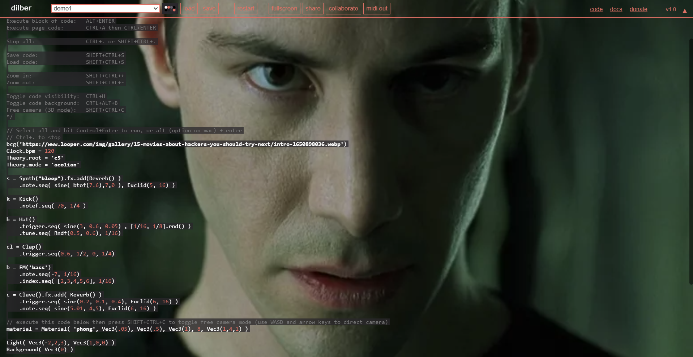

# Dilber | live audio-visual coding environment in Javascript for the browser

## Video


https://github.com/user-attachments/assets/d01a258c-34f4-4e3b-8bd5-1b9b1aaee542


## Features
- Audio synthesys via multiple engines ([Monosynth](https://dilber.io/docs/index.html#instruments-monosynth), [Polysynth](https://dilber.io/docs/index.html#instruments-synth), [FM synth](https://dilber.io/docs/index.html#instruments-fm) ...)
- Video synthesys using [Hydra Video Synth](https://hydra.ojack.xyz/), [P5.js](https://p5js.org/) and [marching.js](https://github.com/charlieroberts/marching)
- Audio and video sequencing (step sequencing, TydalCycles / Strudel notation ...)
- Sample mangling (see [sampler docs](https://dilber.io/docs/index.html#instruments-sampler))
- Audio effects <i>(BitCrusher, Delay, Filter, Distortion, Flanger, Reverb, RingMod, Vibrato, Tremolo, Wavefolder)</i>
- Video effects <i>(Antialiasing, Bloom, Blur, Brightness, Contrast, Edges, Focus, Godrays, Motion Blur, Hue, Invert)</i>
- Camera control <i>(WASD, arrows)</i>
- Play with friends: P2P realtime collaboration with shared editor and chat
- Saving and loading your dilber files from computer
- MIDI out for your external or hardware synths
- Render canvas to video with rec() command

## Where to start
1. Go to [dilber.io](https://dilber.io) and start <i>dilbering</i>!

2. Or clone this repo and run it locally in VS Code using [Live Server extension](https://marketplace.visualstudio.com/items?itemName=ritwickdey.LiveServer)

## Basic commands
```
'Ctrl + Enter' - run line of code at the cursor
'Alt + Enter' - run a block of code
'Ctrl + .' - stop all
 # You can also use Ctrl+A to select all then press Ctrl+Enter to run
```

## Changes
```
- MIDI out support - controll your external synths with Dilber via WebMIDI
- Folder structure:
  ./docs
  ./samples    <-- your samples go here
  ./resources  <-- all other files
   index.html  <-- Main page

- UI fixes for popups and notifications
- Removed all redundant code and unnecesary files
- P2P WebSockets now works properly over wss server
- Added Load and Save functionality so you can export or load dilber files from your computer
- Improved error catching and logging
- Fixed audio when switching between examples
- Added missing sounds from examples
- Added rec(param) command to record canvas in video mode
     - rec() - records until you press CTRL+.
     - rec(5) - e.g. records for 5 seconds
```

## Where to find out more
- Open [dilber.io](https://dilber.io) and take a look at examples/tutorial list (instructions are commented)
- Read the full [documentation](https://dilber.io/docs/index.html)


Dilber is based on [Gibber](https://github.com/gibber-cc/gibber), which is the work of [Charlie Roberts](https://github.com/charlieroberts).
